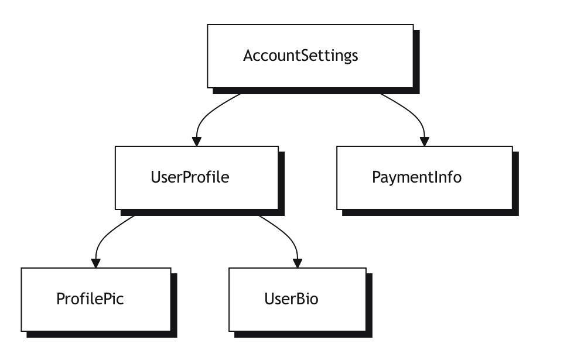
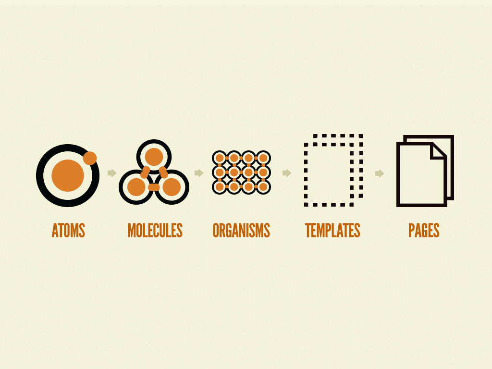

## Modern Angular Refresh

Note: For folks who've used Angular before, or fullstackers who haven’t touched it in a while. Goal: Get everyone productive and up to date with modern Angular practices. Maybe go around the group, current experience levels? Expectations?

---


<div style="">
  
  <h1 style="font-size: 0.9em;">Bjorn Schijff</h1>
  <small style="display: inline-flex;">Sr. Frontend Engineer / Architect</small>
  <div>
    
  </div>
  <small>@Bjeaurn</small>
  <br />
  <small>bjorn.schijff@soprasteria.com</small>
</div>

Note: Introduction, emphasize 9+ years of Angular, AngularJS before that. Love RxJS, reactivity and mainly: Angular. 

---

## Angular Today

[Current Angular version: 20.1.6](https://github.com/angular/angular/tags)<!-- .element: class="fragment" -->

- Standalone APIs<!-- .element: class="fragment" -->
- Updated control-flow<!-- .element: class="fragment" -->
- Signals stable + new APIs<!-- .element: class="fragment" -->
- Release cadence: Major every 6 months<!-- .element: class="fragment" -->
- LTS for 12 months<!-- .element: class="fragment" -->
  
<small class="fragment">
<a href="https://angular.dev/reference/releases#actively-supported-versions" target="_blank">Angular.dev reference</a>
</small>

Note: High-level overview, good to give people orientation on what's changed since they last looked. Standalone: no more modules. New injectors/input/output etc.

---

## Angular CLI

<small class="fragment">Feel free to follow along!</small>

`npm install -g @angular/cli@latest`
<!-- .element: class="fragment" -->

- `ng new`<!-- .element: class="fragment" -->
- Built-in testing, viable minimal app.<!-- .element: class="fragment" -->

```bash
ng new angular-refresh
#  answer some questions
cd angular-refresh
ng serve
```
<!-- .element: class="fragment" -->


Note: Best practices, standalone by default, configurations for all out of the box. Follow along! Who's used the Angular CLI?

----

## CLI usage

<ul>
  <li class="fragment">
    <pre>ng generate [component|service|pipe|etc]</pre>
  </li>
  <li class="fragment">
    <pre>ng g c shared/ui/button</pre>
  </li>
  <li class="fragment">
    <pre>ng g s core/services/auth</pre>
  </li>

  <li class="fragment">
    <pre>ng [serve|test|lint|build|e2e]</pre>
  </li>
</ul>

----

## Additions

```bash
# community managed, adds eslint with angular support
ng add angular-eslint 

# For automated formatting, 
# recommend to also install Prettier.

ng e2e # asks which E2E package to install
```

Note: Expecting a project to grow? Working with a bit of a team? Enterprise grade requirements? Add some good practices with ng-add. Prettier requires a bit of configuration to play nice with ESLint.

---

## Anatomy of an Angular App

```folder
src/
  app/
    features/
      tasks/
        task-list.component.ts
        task-item.component.ts
        task-form.component.ts
        tasks.service.ts // Only required for this feature? Else move to core/shared!
    app.component.ts
    app.routes.ts
    app.module.ts
    main.ts
```
<!-- .element: class="fragment" -->

Note: Diagram: Component Tree, Services, Routing, Modules (optional). Service could live on a different (shared) level if needed.

----

```folder
src/
  app/
    features/
      tasks/
        task-list.ts // component
        task-item.ts // component 
        task-form.ts // component 
        tasks.ts // service / repository / business logic <-- Only this feature?
    app.ts // component
    app.routes.ts
    main.ts
```

Note: Modern new defaults, no more component/service in the name. Discuss? You can change the settings in `angular.json`. https://blog.angular.dev/announcing-angular-v20-b5c9c06cf301 - style guide updates.

----

### Angular Architecture Refresher

- Components: UI logic & template<!-- .element: class="fragment" -->
- Smart components: "Wiring"<!-- .element: class="fragment" -->
- Services: Business logic & Data<!-- .element: class="fragment" -->
- Routing<!-- .element: class="fragment" -->

Note: Go through each, from the smallest part into the more "smart" elements.

----



----



Note: By Bradfrost, atomic design visualised. Speaks to the size and comparison of different types of components.

----

```ts
@Component({
  selector: 'my-app',
  template: `<h1>Hello {{ name }}</h1>`
})
export class AppComponent {
  name = 'Angular';
}
```

Note: Simplest app component. Could be an atom?

----

```ts
@Component({
  selector: 'my-button',
  template: `<button (click)="buttonClicked()">{{ title }}</button>`
})
export class ButtonComponent {
  title = 'Click me!';

  buttonClicked() {
    // Do something!
  }
}
```

Note: Possible Atom component, easy to reuse and has a very small single responsibility in providing a clickable element to be used in larger molecules or organisms.

----

## Old Inputs & Outputs

- @Input() and @Output() still alive and well
- Used for communication between parent/child

```js
@Input() title: string = '';
@Output() clicked = new EventEmitter<void>();
```

Note: Making atoms or molecules usable requires you to be able to customize them for different purposes. This is the old way! This requires you to use things like ngOnChanges and all that.

----

## Signal based Inputs & Outputs

- input() & output()
- Used for communication between parent/child
- Signal based changes

```ts
title = input('title'); // ReadOnlySignal<string>, type is inferred from default. Override with <T>
clicked = output(); // has a `.emit()` like EventEmitters did.
```

Note: You can use the title() signal to create a more declarative approach within your component.

----


```ts
@Component({
  selector: 'my-button',
  template: `<button 
    (click)="buttonClicked.emit()" 
    [class]="class()">
      {{ title() }}
  </button>`
})
export class AppComponent {
  title = input('Click me!');
  color = input('primary');

  class = computed(() => this.color()) 
  // We'll get to this one in the Reactivity training.

  buttonClicked = output();
}
```

Note: Small, modern atom of a Button. Perfect start for your /share/ui/button.

---

## Injectables

```ts
@Component({
  selector: 'app-component'
})
export class AppComponent {
  
  constructor(private oldway: AppService) {}
  // Old way of doing injection, still works! :)

  appService = inject(AppService); 
  // New way, much cleaner!
}
```

Note: Much more clean, when it comes to large smart components dealing with lots of interactions. Large constructor is not nice. However, it could also point to a component that is doing too much.

---

## Communication Pattern Options

<!-- TODO table: Inputs/Outputs vs Service-based vs State Management -->

- Start with Inputs/Outputs<!-- .element: class="fragment" -->
- Add services for cross-component state<!-- .element: class="fragment" -->
- Signals? Great for local component state<!-- .element: class="fragment" -->

Keep your (shared) UI components as "dumb" as possible. Services are a form of coupling!<!-- .element: class="fragment" -->

Note: Acknowledge that there are many paths, depending on app scale.

---

## Signals! The New Reactive Primitive

```ts
import { signal, computed, effect } from '@angular/core';

const count = signal(0);

effect(() => console.log('Count changed:', count()));
```

Note: Think of Signals as Angular’s new way of handling state. It’s local, reactive, and avoids the complexity of Observables.

----

## Gotcha - Functions in Templates

```ts
@Component({
  selector: 'my-button',
  template: `<button 
    (click)="buttonClicked.emit()" 
    [class]="class()">
      {{ title() }} {{ test() }}
  </button>`
})
export class Component {
  title = input('title');

  function test() {
    console.count('detecting')
    return Math.random();
  }

}
```

click, class, title and test.

Note: Signals need to be "evaluated" as a function. Angular knows this is a Signal and therefore can subscribe to changes, making change detection very granular. However, doing manual functions in your HTML is still very bad. There is unfortunately no way of recognizing which is which.

---

```ts
@Component({
  standalone: true,
  selector: 'counter',
  template: `
    <button (click)="inc()">Clicked {{ count() }} times</button>
  `
})
export class Counter {
  count = signal(0);
  inc() { this.count.update(n => n + 1); }
}
```

Note: Super clean. No RxJS. Ask: Who prefers this over BehaviorSubject?

---

## State Management in Angular

- Still many options: RxJS, NGXS, Akita, NgRx
- For many apps, Signals + Services are enough
- RxJS still great for async and event-based data

Note: Show a basic state service pattern with a Signal store

----

### Optional: Build a Tiny Signal-based Store

```ts
@Injectable({ providedIn: 'root' })
export class TodoStore {
  private todos = signal<string[]>([]);
  readonly count = computed(() => this.todos().length);

  add(todo: string) {
    this.todos.update(t => [...t, todo]);
  }
}
```

Note: Great bridge to modern state patterns. Go over this example and discuss.

---

## Control-flow

```ts
*ngFor
*ngIf
[ngSwitch] & *ngSwitchCase
```

<small class="fragment">
Migrate: 
  <pre>ng generate @angular/core:control-flow</pre>
</small>

Note: Ring a bell for any? Deprecated. Migrate using command above.

----

## New control-flow

```html
@let
@for () {}
@if () {}
```

----

```js
@let data = data$ | async
@if (data.length > 0) {
  <div><h1>Title</h1>
  <ul>
    @for (item of data; track item.id) {
      @switch(item.type) {
        @case ('thing') {
          <li class="thing">{{ item.name }}</li>
        }
        @default {
          <li>{{item.name}}</li>
        }
      }
    }
  </ul>
}
```
<small class="fragment"><a href="https://angular.dev/guide/templates/control-flow" target="_blank">Guide templates control-flow</a></small>

Note: Extensive example of how to use the new control flow. Link to control-flow guide.

----

## More control flow

- @defer, @placeholder, @loading
- @error
- on: idle, viewport, interaction, hover, etc.

<small class="fragment"><a href="https://angular.dev/guide/templates/defer" target="_blank">defer guide</a></small>

Note: Additional control flow options for better code-splitting, faster loads and less JS shipped. Only showing (or downloading components!) when hovered, or interacted with.

---

## Angular's packages refresher
the included batteries

<small>

- @angular/router<!-- .element: class="fragment" -->
- @angular/forms (incl. ReactiveForms, SignalForms soon)<!-- .element: class="fragment" -->
- @angular/common (directives, pipes and HttpClient)<!-- .element: class="fragment" -->
- @angular/core/rxjs-interop<!-- .element: class="fragment" -->

</small>

<small class="fragment"><a href="https://angular.dev/overview/" target="_blank">angular.dev guides</a></small>

Note: All these have excellent guides on angular.dev, https://angular.dev/ecosystem/rxjs-interop. Check the styleguide and adhere to its principles, so all Angular applications look alike and are easy to reason about.

---

# Summary
## What’s New & What Matters

- ✅ CLI for best practices<!-- .element: class="fragment" -->
- ✅ Standalone components<!-- .element: class="fragment" -->
- ✅ Signals = reactive state<!-- .element: class="fragment" -->
- ✅ New control-flow directives<!-- .element: class="fragment" -->
- ✅ Angular comes batteries included<!-- .element: class="fragment" -->

---

# Thanks!

